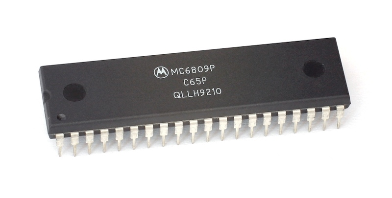

# MC6809



## Introduction

A library written in C++ that emulates the MC6809 cpu. The enclosed ```CMakeLists.txt``` file (standard cmake procedure) will build the library and a small test application. To use this library in your project, copy the five source files from ```./src/``` into your source tree.

At this very moment, the following things are not implemented:
* CWAI opcode
* illegal opcode exceptions (vector at $fff0)

## API

### Constructor

```cpp
mc6809::mc6809()
```

### Read and Write to Memory

Abstract class, read8 and write8 must be implemented in your subclass.

Make sure the connected memory has a functioning ROM and vector table from ```$fff0``` to ```$ffff```. Please note that an extra vector at ```$fff0``` (originally reserved by Motorola) has been added that enables handling of illegal opcodes (a feature borrowed from the Hitachi 6309).

### NMI / FIRQ / IRQ

When nothing is assigned by the hosting software, the pin states will default to high (```1``` or ```true```) internally, effectively meaning no exceptions of the above three types will happen. It is up to the programmer to supply proper connections:

```cpp
void mc6809::assign_nmi_line(bool *line)
```

```cpp
void mc6809::assign_firq_line(bool *line)
```

```cpp
void mc6809::assign_irq_line(bool *line)
```

These functions take a pointer to a boolean value (the actual line/value that represent interrupt states from the connected devices). If more devices are to be connected to one line, this must be separately programmed (see [E64](https://github.com/elmerucr/E64) source code for an example, ```exceptions_ic``` class).

### Reset

```cpp
void mc6809::reset()
```

### Execute

```cpp
uint8_t mc6809::execute()
```

Main execute function. Runs only one instruction, and returns the number of cycles consumed. Checking for breakpoints must be done with the ```mc6809::breakpoint()``` member function inbetween calls to the ```mc6809::execute()``` function. In the broadest sense, one instruction also means starting an exception (be it nmi/firq/irq).

Running more that one instruction or the ability to run ```N``` cycles has been considered but is not implemented. In most use cases we want to do nmi/firq/irq things immediately after each instruction anyway. Also checking for breakpoints becomes simpler this way.

## Links

* [E64](https://github.com/elmerucr/E64) - A virtual computer system inspired by the Commodore 64 using an MC6809 cpu and implementing some Amiga 500 and Atari ST technology.
* [lib65ce02](https://github.com/elmerucr/lib65ce02) - CSG65CE02 emulator written in C.
* [Moira](https://github.com/dirkwhoffmann/Moira) - Motorola 68000 cpu emulator written in C++ by Dirk W. Hoffmann.
* [vAmiga](https://dirkwhoffmann.github.io/vAmiga/) - An Amiga 500, 1000, or 2000 on your Apple Macintosh by Dirk W. Hoffmann.
* [vasm](http://sun.hasenbraten.de/vasm/) - A portable and retargetable assembler.
* [VICE](http://vice-emu.sourceforge.net) - The Versatile Commodore Emulator.
* [VirtualC64](https://dirkwhoffmann.github.io/virtualc64/) - A Commodore 64 on your Apple Macintosh by Dirk W. Hoffmann.
* [vlink](http://sun.hasenbraten.de/vlink/) - A portable linker for multiple file formats.

## References

Leventhal, Lance A. 1981. 6809 ASSEMBLY LANGUAGE PROGRAMMING. OSBORNE/McGraw-Hill.

Motorola. 1981. MC6809-MC6809E 8-BIT Microprocessor Programming Manual. Motorola Inc.

Motorola Semiconductors. 1983. MC6809 Datasheet.

Osborne, Adam. 1976. An introduction to microcomputers - Volume I Basic Concepts. SYBEX.

Zaks, Rodnay and William Labiak. 1982. Programming the 6809. SYBEX.
